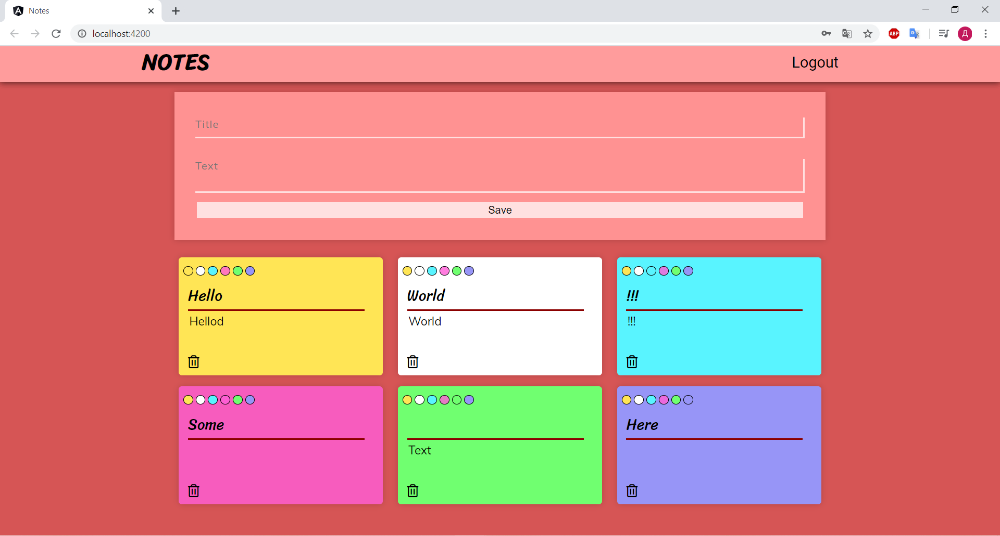

# Notes
This application help you to manage your schedules and affairs. It gives you a quick and simple notepad editing experience when you write
notes, memo, shopping list and to do list. You can add a note, delete it and change.

## Structure
* There is frontend on Angular in folder "Note".
* There are "deno" and "security demo" in "spring" folder. In "demo" backend on Spring, in "security demo" REST Api also in Spring.

## Usage
* [Angular](https://angular.io/) - web application framework
* [Angular Material](https://material.angular.io/) - UI component library for Angular
* [Spring](https://spring.io/) - Java framework
* [Maven](https://maven.apache.org/) - Dependency Management

## Project status
This is a working version, but i want add some corretions and function in future.
